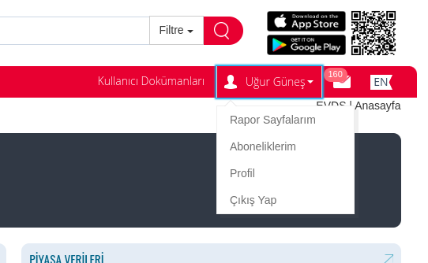
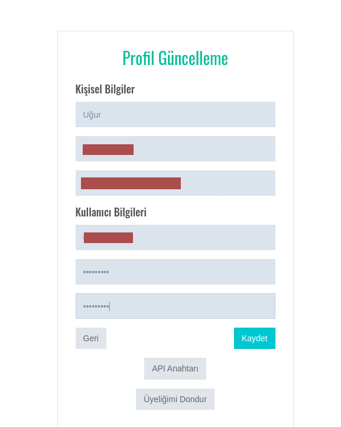
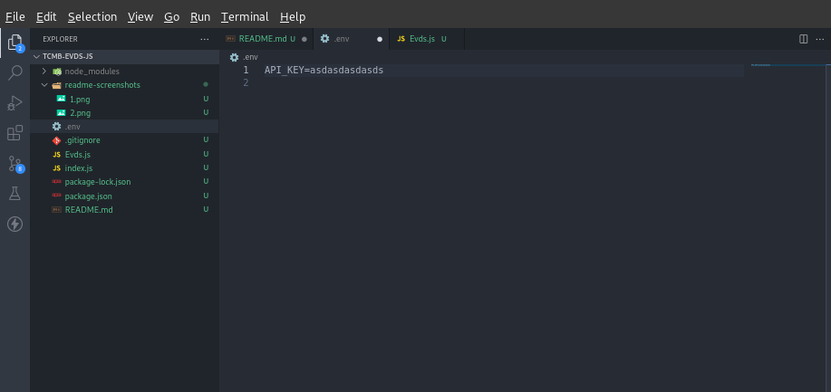

# Nedir?

> Bu repo Türkiye Cumguriyeti Merkez Bankası'ndaki veri çekmek için [bu adresteki python](https://pypi.org/project/evds/) modülünden esinlenilerek oluşturulmuştur. Python modülündeki tüm işlevler tamamlanmamış olup, şu anki haliyle sadece son bir günlük 'USD' ve 'EUR' bilgilerini döndürmektedir.

## Nasıl Kullanılır?

### API Anahtarı Alma

- evds paketini kullanmak için öncelikle EVDS sistemi üzerinden API Anahtarı almanız gerekmektedir. API Anahtarı almak için aşağıdaki adımları izleyiniz:
- - [EVDS](https://evds2.tcmb.gov.tr/index.php?/evds/login) adresinden 'Kayıt Olun' butonuna tıklayarak bir hesap oluşturun.
  - Ardından kullanıcı adınızın altında yer alan profil bağlantısına tıklayınız.
  - 
  - Profil sayfanızın alt kısmında yer alan "API Anahtarı" butonuna tıklayınız ve açılan kutucukta yer alan değeri kopyalayınız.
  - 

### Projeye Dahil Etme

- .env dosyasını oluşturup içerisine `API_KEY` isminde bir değer ekleyin ve ilk adımda aldığın api key'inizi bunun içerisine ekleyin.
- 
- `Evds.js` dosyasını projenizde uygun gördüğünüz bir yere kopyalayın.
- Evds classını projenizde çağırın ve bir instance oluşturun.
- Son olarak tek yapmanız gereken `getData` fonksiyonunu çağırmak ve oradan dönen değerleri almak.
- ```javascript
  const Evds = require("./Evds");

  const evds = new Evds();

  evds
    .getData()
    .then((res) => console.log(res))
    .catch((err) => console.log(err));
  ```

---

> NOT: getData fonksiyonundan dönen veri tipi aşağıdaki gibidir.

```json
{
  "dün": { "TARIH": "31-01-2023", "USD": "18.7876", "EUR": "20.4525" },
  "bugün": { "TARIH": "01-02-2023", "USD": "18.7878", "EUR": "20.3458" }
}
```

> NOT2: Proje dizinim aşağıdaki şekildedir.

```console
ugur@merdumgiriz:~/Documents/tcmb-evds-js$ tree
.
├── Evds.js
├── index.js
├── package.json
├── package-lock.json
└── README.md

1 directory, 8 files
```
